# Student Project Hub - Архитектура системы

## 📋 Оглавление

1. [Обзор системы](#обзор-системы)
2. [Концепция проекта](#концепция-проекта)
3. [Проблематика и решение](#проблематика-и-решение)
4. [Целевая аудитория](#целевая-аудитория)
5. [Функциональные возможности](#функциональные-возможности)
6. [Архитектура](#архитектура)
7. [Микросервисы](#микросервисы)
8. [База данных](#база-данных)
9. [API Gateway](#api-gateway)
10. [Аутентификация и авторизация](#аутентификация-и-авторизация)
11. [Пользовательские сценарии](#пользовательские-сценарии)
12. [Deployment](#deployment)
13. [Масштабирование](#масштабирование)
14. [Безопасность](#безопасность)
15. [Мониторинг](#мониторинг)
16. [Roadmap](#roadmap)

---

## 🎯 Обзор системы

**Student Project Hub** - современная веб-платформа для управления студенческими проектами, организации командной работы и автоматизации процесса сдачи и проверки учебных заданий.

### Краткое описание

Платформа представляет собой полнофункциональную систему управления проектами, специально адаптированную для образовательной среды. Она объединяет студентов, преподавателей и администраторов в единой экосистеме, обеспечивая прозрачность образовательного процесса и упрощая взаимодействие между участниками.

### Основные возможности

- 🔐 **JWT-based аутентификация** - безопасная система входа с токенами
- 👥 **Управление профилями** - профили студентов и преподавателей с навыками
- 📁 **Проектный менеджмент** - создание проектов, задач, дедлайны
- ✅ **Kanban-доски** - визуализация задач по статусам
- 📤 **Система сдачи работ** - загрузка работ с ссылками на репозитории
- ⭐ **Оценивание** - детальная система оценок с комментариями
- 📊 **Dashboard** - персональная аналитика для каждого пользователя
- 🔔 **История действий** - прозрачность всех операций

### Технологический стек

**Backend:**
- Python 3.11
- Django 5.0
- Django REST Framework 3.14
- PostgreSQL 15
- JWT (djangorestframework-simplejwt)
- drf-yasg (Swagger/OpenAPI)

**Frontend:**
- React 18
- Vite 7
- Zustand (state management)
- Axios (HTTP client)
- Lucide React (иконки)
- React Router (навигация)

**Infrastructure:**
- Docker & Docker Compose
- PostgreSQL (4 отдельные базы)
- Nginx (опционально как API Gateway)

---

## 💡 Концепция проекта

### Зачем нужен этот проект?

В современном образовании проектная деятельность играет ключевую роль. Студенты работают над курсовыми проектами, дипломными работами, групповыми заданиями. Преподавателям необходимо отслеживать прогресс, давать обратную связь, оценивать результаты.

**Student Project Hub** создан чтобы:

1. **Централизовать управление проектами** - все проекты, задачи и участники в одном месте
2. **Автоматизировать рутинные процессы** - сдача работ, оценивание, уведомления
3. **Улучшить коммуникацию** - между студентами, между студентами и преподавателями
4. **Обеспечить прозрачность** - каждый видит статус своих задач и проектов
5. **Сохранить историю** - все проекты, комментарии и оценки хранятся в системе

### Философия проекта

**Простота** - интуитивно понятный интерфейс, минимум кликов для выполнения задач

**Гибкость** - адаптируется под разные образовательные модели и методологии

**Надёжность** - микросервисная архитектура обеспечивает отказоустойчивость

**Масштабируемость** - от небольших групп до университетов с тысячами студентов

---

## 🎭 Проблематика и решение

### Проблемы текущих решений

#### 1. **Разрозненность инструментов**

**Проблема:** Студенты и преподаватели используют множество несвязанных инструментов:
- Email для сдачи работ
- Excel/Google Sheets для отслеживания оценок
- Мессенджеры для коммуникации
- GitHub для кода
- Google Drive для документов

**Результат:** Информация разбросана, легко потерять важные данные, сложно отследить прогресс.

**Наше решение:** Единая платформа объединяет все аспекты проектной работы - от постановки задач до оценивания результатов.

#### 2. **Отсутствие единого источника правды**

**Проблема:** Когда проект обсуждается в email, код на GitHub, документация в Google Docs, а задачи в Trello - непонятно где искать актуальную информацию.

**Результат:** Путаница, дублирование работы, пропущенные дедлайны.

**Наше решение:** Вся информация о проекте в одном месте - описание, участники, задачи, сдачи, оценки, комментарии.

#### 3. **Неэффективная обратная связь**

**Проблема:** Преподаватель получает работы по email, проверяет, отправляет комментарии обратно по email. Студент исправляет и отправляет снова.

**Результат:** Долгий цикл обратной связи, потерянные письма, сложность отслеживания версий.

**Наше решение:** Встроенная система сдачи работ с версионированием, детальными комментариями и возможностью доработки.

#### 4. **Отсутствие прозрачности**

**Проблема:** Студент не знает статус проверки своей работы. Преподаватель не видит кто уже сдал, а кто нет. Администрация не может оценить загруженность преподавателей.

**Результат:** Стресс, неопределённость, неэффективное планирование.

**Наше решение:** Dashboard с реальным временем статусов - студент видит прогресс проверки, преподаватель видит все сдачи, администрация видит общую картину.

#### 5. **Сложность совместной работы**

**Проблема:** Когда над проектом работает команда из 3-5 человек, координация становится проблемой - кто что делает, кто за что отвечает, какой прогресс.

**Результат:** Конфликты в команде, дублирование усилий, пропущенные задачи.

**Наше решение:** Kanban-доски для визуализации задач, назначение ответственных, комментарии в контексте задачи, история изменений.

---

## 👥 Целевая аудитория

### 1. Студенты (Primary Users)

**Кто они:**
- Учащиеся университетов и колледжей
- Работают над курсовыми, дипломными, групповыми проектами
- Возраст: 18-25 лет
- Tech-savvy, привыкли к онлайн-инструментам

**Что им нужно:**
- Простой способ сдавать работы
- Видеть свои задачи и дедлайны
- Получать обратную связь от преподавателей
- Координировать работу в команде
- Отслеживать свой прогресс и оценки

**Как платформа помогает:**
- Всё в одном месте - проекты, задачи, дедлайны
- Уведомления о важных событиях
- Kanban-доски для командной работы
- Прозрачная система оценивания
- Портфолио проектов с оценками

### 2. Преподаватели (Primary Users)

**Кто они:**
- Ведут курсы в университетах
- Курируют проекты студентов
- Проверяют и оценивают работы
- Возраст: 30-60 лет

**Что им нужно:**
- Эффективно проверять работы студентов
- Давать структурированную обратную связь
- Отслеживать прогресс всех студентов
- Выставлять оценки и вести учёт
- Минимизировать административную работу

**Как платформа помогает:**
- Структурированная система сдачи работ
- Встроенная система оценивания с комментариями
- Dashboard с прогрессом всех студентов
- Автоматические уведомления о новых сдачах
- История всех работ и оценок

### 3. Администраторы (Secondary Users)

**Кто они:**
- Деканы, заведующие кафедрами
- Методисты, администраторы
- Ответственные за качество образования

**Что им нужно:**
- Видеть общую картину учебного процесса
- Оценивать загруженность преподавателей
- Отслеживать качество обучения
- Получать отчёты и аналитику

**Как платформа помогает:**
- Дашборды с общей статистикой
- Отчёты по проектам и оценкам
- Мониторинг активности

---

## 🎨 Функциональные возможности

### 1. Система аутентификации и авторизации

#### Регистрация и вход

**Регистрация:**
- Форма: имя, фамилия, email, username, пароль
- Выбор роли: студент или преподаватель
- Валидация данных
- Хэширование паролей

**Вход:**
- По username и паролю
- JWT токены (access + refresh)
- Access token живёт 1 час
- Refresh token живёт 7 дней
- Автоматическое обновление токенов

**Профиль:**
- Персональная информация
- Контакты (email, telegram, github, linkedin)
- Образование (для студентов): университет, факультет, курс, группа
- Навыки с уровнями (beginner/intermediate/advanced/expert)
- Портфолио выполненных проектов

**Безопасность:**
- JWT с коротким временем жизни
- Refresh token rotation
- Token blacklisting при выходе
- Защита от CSRF
- CORS настройки

#### Зачем это нужно:

- **Персонализация:** Каждый видит только свои проекты и задачи
- **Безопасность:** Работы студентов защищены от посторонних
- **Разграничение прав:** Студент не может оценивать, преподаватель не видит чужие курсы
- **Идентификация:** Понятно кто что сделал, кто ответственный

### 2. Управление проектами

#### Создание и настройка проекта

**Основные параметры:**
- **Название** - краткое и ёмкое
- **Описание** - подробное описание целей и задач
- **Статус** - planning/in_progress/review/completed/archived
- **Дедлайн** - крайний срок сдачи
- **Репозиторий** - ссылка на GitHub/GitLab
- **Владелец** - создатель проекта (автоматически)
- **Преподаватель** - кто курирует (опционально)

#### Командная работа

**Участники проекта:**
- **Owner** - полные права, создатель
- **Member** - может создавать задачи, сдавать работы
- **Viewer** - только просмотр

**Управление командой:**
- Добавление/удаление участников
- Изменение ролей
- История участия
- Вклад каждого (количество задач, коммитов)

#### Kanban-доска задач

```
┌─────────────┬─────────────┬─────────────┬─────────────┐
│   TO DO     │ IN PROGRESS │   REVIEW    │    DONE     │
├─────────────┼─────────────┼─────────────┼─────────────┤
│ • Задача 1  │ • Задача 3  │ • Задача 5  │ • Задача 7  │
│ • Задача 2  │ • Задача 4  │ • Задача 6  │ • Задача 8  │
│             │             │             │ • Задача 9  │
└─────────────┴─────────────┴─────────────┴─────────────┘
```

**Карточка задачи:**
- Название и описание
- Приоритет (low/medium/high/urgent)
- Ответственный (assignee)
- Дедлайн
- Статус
- Комментарии
- История изменений

#### Зачем это нужно:

**Для студентов:**
- Структурировать работу над проектом
- Распределить обязанности в команде
- Видеть общий прогресс
- Не пропустить дедлайны

**Для преподавателей:**
- Отслеживать прогресс в реальном времени
- Видеть вклад каждого участника
- Давать советы на ранних этапах
- Оценивать процесс, а не только результат

### 3. Система задач (Tasks)

#### Создание задачи

**Обязательные поля:**
- Название задачи
- Проект (к которому относится)

**Дополнительные:**
- **Описание** - что нужно сделать
- **Приоритет:**
  - 🟢 Low - можно сделать позже
  - 🔵 Medium - сделать в рамках спринта
  - 🟡 High - сделать в ближайшие дни
  - 🔴 Urgent - сделать сегодня
- **Статус:**
  - 📝 To Do - нужно сделать
  - 🔄 In Progress - в работе
  - 👀 Review - на проверке
  - ✅ Done - завершено
- **Ответственный** - кто выполняет
- **Дедлайн** - когда нужно завершить

#### Workflow задачи

```
To Do → In Progress → Review → Done
         ↓              ↓
      (можно вернуть назад при необходимости)
```

#### Фильтрация и поиск

**Фильтры:**
- По статусу
- По приоритету
- По ответственному
- По дедлайну (просроченные, на этой неделе...)
- По проекту

**Сортировка:**
- По дате создания
- По приоритету
- По дедлайну

### 4. Сдача и проверка работ

#### Процесс сдачи работы студентом

**Шаг 1: Создание сдачи**
- Название работы
- Описание выполненного
- Ссылки:
  - Репозиторий (GitHub/GitLab)
  - Демо (развёрнутое приложение)
  - Документация
- Прикреплённые файлы (презентация, отчёт, скриншоты)

**Шаг 2: Отправка**
- Система фиксирует дату и время
- Присваивает статус "Pending" (ожидает проверки)
- Отправляет уведомление преподавателю

#### Процесс проверки преподавателем

**Просмотр работы:**
- Вся информация о сдаче
- Профиль студента
- Критерии оценки
- История предыдущих итераций

**Оценивание:**
- Выставление оценки (0-100)
- Выбор статуса:
  - ✅ Approved - принято
  - ❌ Rejected - отклонено
  - 🔄 Revision Required - требует доработки
- Развёрнутый отзыв:
  - Что сделано хорошо
  - Что нужно улучшить
  - Конкретные рекомендации

**Обратная связь студенту:**
- Уведомление о проверке
- Оценка с обоснованием
- Детальные комментарии
- Рекомендации

#### Система оценивания

**Шкала:**
- 90-100: Отлично (A)
- 75-89: Хорошо (B)
- 60-74: Удовлетворительно (C)
- 50-59: Посредственно (D)
- 0-49: Неудовлетворительно (F)

**Критерии:**
- Функциональность (30%)
- Качество кода (25%)
- Документация (20%)
- UI/UX (15%)
- Тестирование (10%)

### 5. Dashboard (Панель управления)

#### Dashboard студента

**Статистика:**
- Активных проектов
- Задач к выполнению
- Средний балл
- Выполнено в срок (%)

**Виджеты:**
1. **Активные проекты** - список с прогрессом
2. **Мои задачи** - сортировка по приоритету
3. **Последние сдачи** - статус проверки
4. **Календарь дедлайнов** - визуализация
5. **Прогресс обучения** - график оценок

#### Dashboard преподавателя

**Статистика:**
- Курируемые курсы
- Количество студентов
- Ожидают проверки (работ)
- Средний балл группы

**Виджеты:**
1. **Очередь проверки** - новые сдачи
2. **Активные проекты** - все проекты студентов
3. **Проблемные студенты** - кто отстаёт
4. **Аналитика** - распределение оценок
5. **Календарь** - дедлайны и события

---

## 🏗️ Архитектура

### High-Level Architecture

```mermaid
graph TB
    subgraph "Client Layer"
        FE[React Frontend<br/>Port 5173]
    end
    
    subgraph "API Gateway Layer"
        NGINX[Nginx<br/>Port 80]
    end
    
    subgraph "Microservices Layer"
        AUTH[Auth Service<br/>Port 8001]
        USER[User Service<br/>Port 8002]
        PROJ[Project Service<br/>Port 8003]
        SUBM[Submission Service<br/>Port 8004]
    end
    
    subgraph "Data Layer"
        DB1[(auth_db)]
        DB2[(user_db)]
        DB3[(project_db)]
        DB4[(submission_db)]
    end
    
    FE -->|HTTP/REST| NGINX
    NGINX -->|/api/auth/*| AUTH
    NGINX -->|/api/users/*| USER
    NGINX -->|/api/projects/*| PROJ
    NGINX -->|/api/submissions/*| SUBM
    
    AUTH ---|PostgreSQL| DB1
    USER ---|PostgreSQL| DB2
    PROJ ---|PostgreSQL| DB3
    SUBM ---|PostgreSQL| DB4
    
    USER -.->|Verify JWT| AUTH
    PROJ -.->|Verify JWT| AUTH
    SUBM -.->|Verify JWT| AUTH
```

### System Architecture Diagram

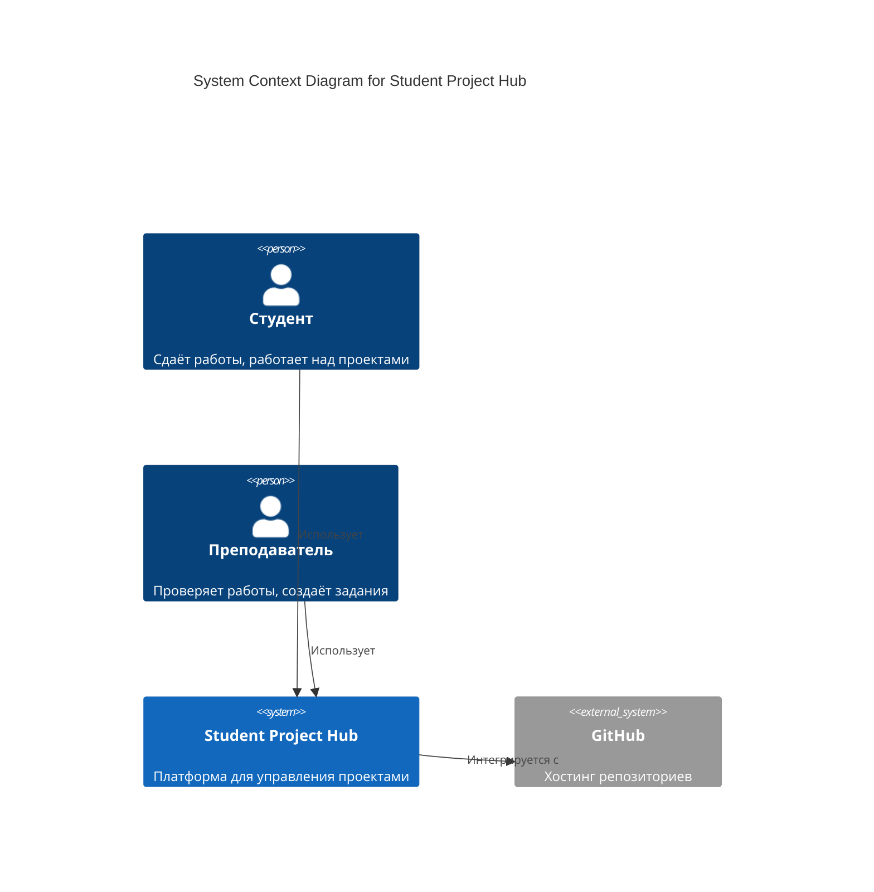

### Microservices Architecture

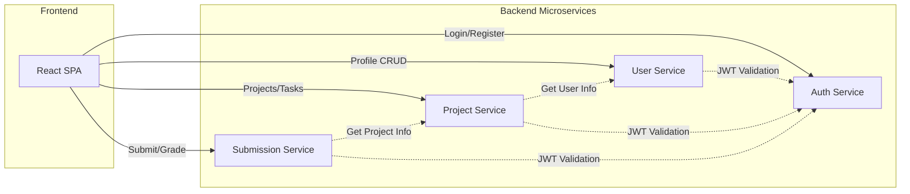

---

## 🔧 Микросервисы

### 1. Auth Service (Port 8001)

**Ответственность:**
- Регистрация пользователей
- Аутентификация (JWT)
- Управление токенами
- Blacklist для refresh tokens

**Endpoints:**
- `POST /api/register/` - Регистрация
- `POST /api/login/` - Вход
- `POST /api/logout/` - Выход
- `POST /api/token/refresh/` - Обновление токена
- `GET /api/users/me/` - Текущий пользователь
- `GET /api/users/` - Список пользователей

**Database Schema:**

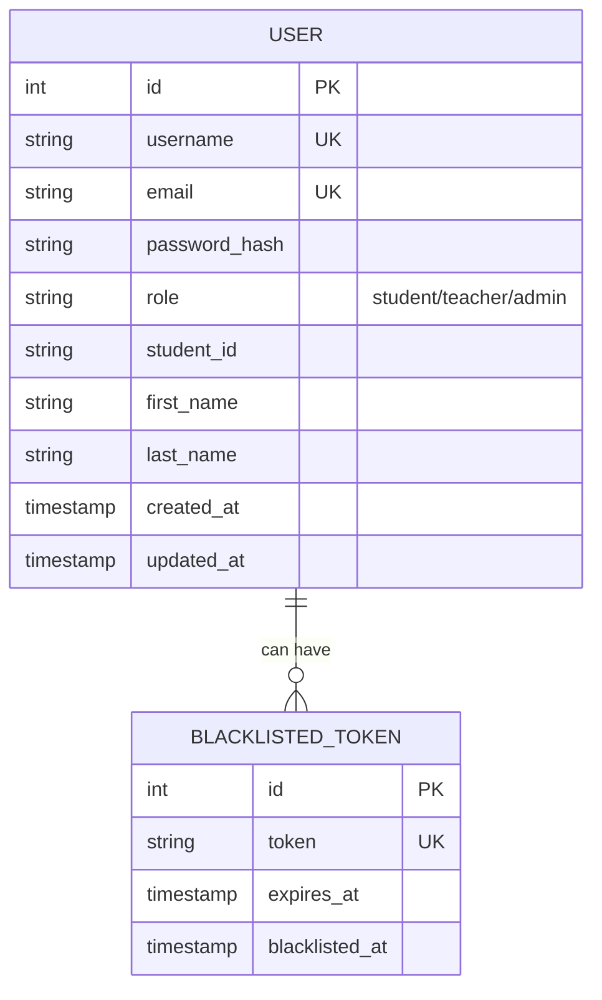

**Tech Stack:**
- Django 5.0
- DRF + JWT
- PostgreSQL (auth_db)

### 2. User Service (Port 8002)

**Ответственность:**
- Управление профилями пользователей
- Навыки и компетенции
- Контактная информация
- Образование

**Endpoints:**
- `GET /api/profiles/` - Список профилей
- `GET /api/profiles/{id}/` - Профиль по ID
- `GET /api/profiles/me/` - Мой профиль
- `POST /api/profiles/` - Создать профиль
- `PUT /api/profiles/{id}/` - Обновить профиль
- `POST /api/profiles/{id}/add_skill/` - Добавить навык
- `DELETE /api/profiles/{id}/remove_skill/{skill_id}/` - Удалить навык

**Database Schema:**

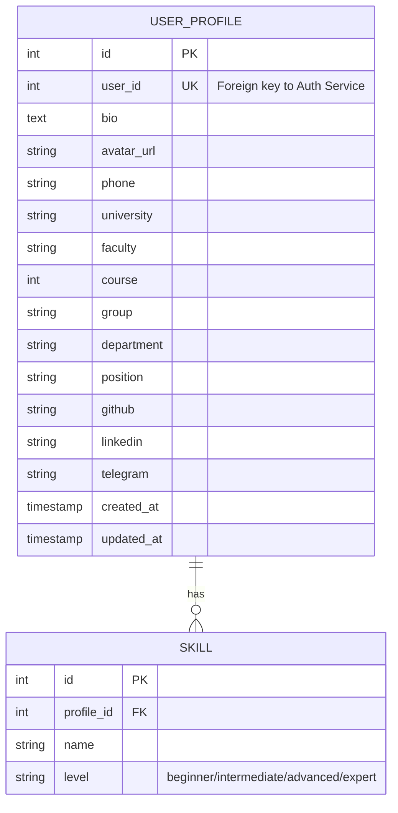

**Tech Stack:**
- Django 5.0
- DRF + Custom JWT Auth
- PostgreSQL (user_db)

### 3. Project Service (Port 8003)

**Ответственность:**
- Управление проектами
- Задачи (Tasks)
- Участники проектов
- Статусы и дедлайны

**Endpoints:**

**Projects:**
- `GET /api/projects/` - Все проекты
- `GET /api/projects/{id}/` - Проект по ID
- `GET /api/projects/my_projects/` - Мои проекты
- `POST /api/projects/` - Создать проект
- `PUT /api/projects/{id}/` - Обновить проект
- `DELETE /api/projects/{id}/` - Удалить проект
- `POST /api/projects/{id}/add_member/` - Добавить участника
- `DELETE /api/projects/{id}/remove_member/{user_id}/` - Удалить участника

**Tasks:**
- `GET /api/tasks/` - Все задачи
- `GET /api/tasks/{id}/` - Задача по ID
- `GET /api/tasks/my_tasks/` - Мои задачи
- `POST /api/tasks/` - Создать задачу
- `PUT /api/tasks/{id}/` - Обновить задачу
- `DELETE /api/tasks/{id}/` - Удалить задачу

**Database Schema:**

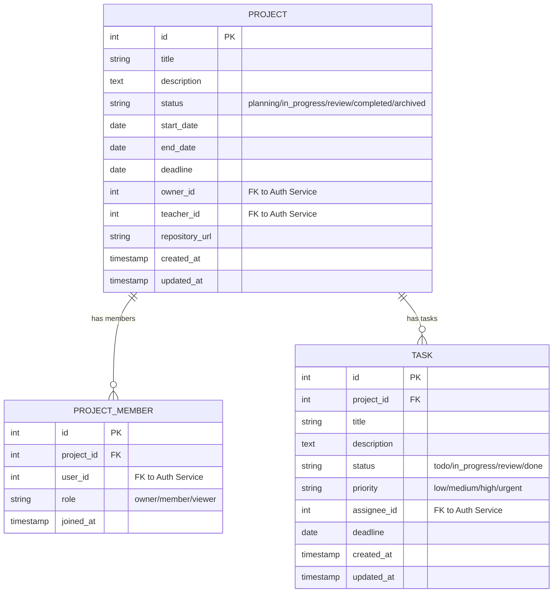

**Tech Stack:**
- Django 5.0
- DRF + Custom JWT Auth
- PostgreSQL (project_db)

### 4. Submission Service (Port 8004)

**Ответственность:**
- Сдача работ студентами
- Оценка работ преподавателями
- Отзывы и комментарии
- Прикрепленные файлы

**Endpoints:**

**Submissions:**
- `GET /api/submissions/` - Все сдачи
- `GET /api/submissions/{id}/` - Сдача по ID
- `GET /api/submissions/my_submissions/` - Мои сдачи
- `POST /api/submissions/` - Создать сдачу
- `PUT /api/submissions/{id}/` - Обновить сдачу
- `POST /api/submissions/{id}/grade/` - Оценить работу
- `POST /api/submissions/{id}/add_attachment/` - Добавить файл

**Reviews:**
- `GET /api/reviews/` - Все отзывы
- `POST /api/reviews/` - Создать отзыв

**Database Schema:**

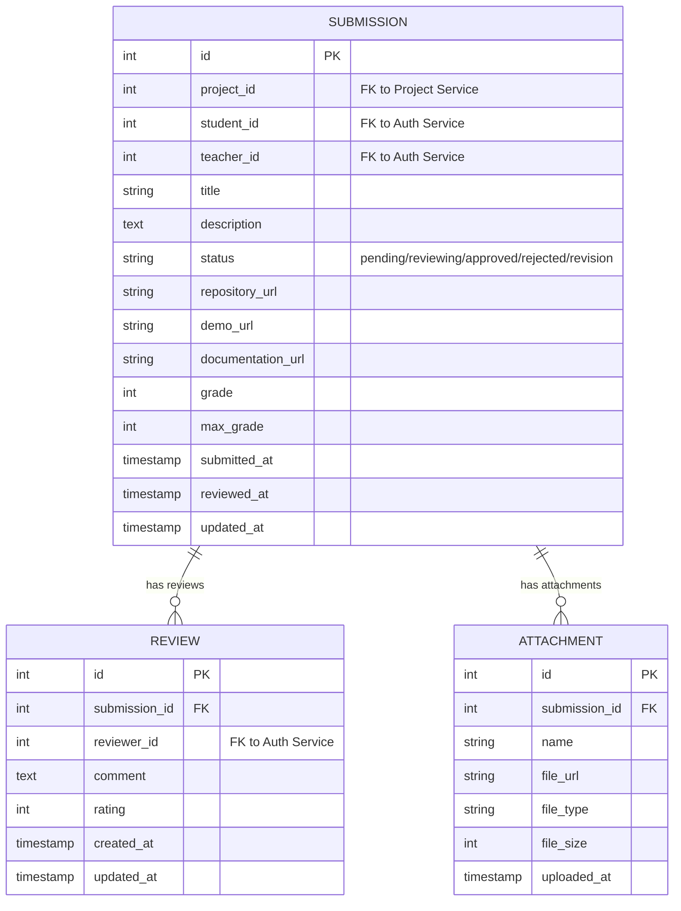

**Tech Stack:**
- Django 5.0
- DRF + Custom JWT Auth
- PostgreSQL (submission_db)

---

## 🗄️ База данных

### Database Architecture

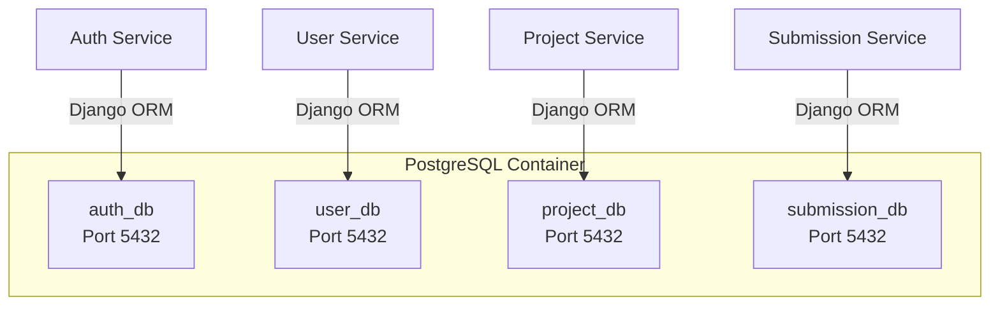

### Database per Service Pattern

Каждый микросервис имеет **собственную базу данных**, что обеспечивает:

✅ **Изоляцию данных** - сбой одного сервиса не влияет на другие  
✅ **Независимое масштабирование** - каждая БД может масштабироваться отдельно  
✅ **Технологическую свободу** - можно использовать разные СУБД  
✅ **Простоту развертывания** - сервисы можно деплоить независимо  

❌ **Сложности:**
- Нет foreign keys между сервисами
- Требуется eventual consistency
- Сложнее делать JOIN запросы

### Data Flow Example: Creating a Project

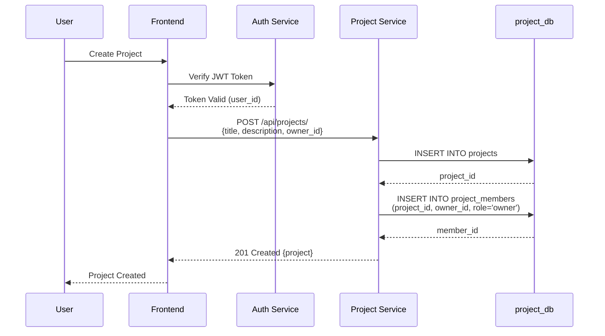

---

## 🌐 API Gateway

### Nginx Configuration

Nginx работает как **reverse proxy** и **API Gateway**:

```nginx
http {
    # Auth Service
    location /api/auth/ {
        proxy_pass http://auth_service:8001/api/;
    }
    
    # User Service  
    location /api/users/ {
        proxy_pass http://user_service:8002/api/;
    }
    
    # Project Service
    location /api/projects/ {
        proxy_pass http://project_service:8003/api/;
    }
    
    # Submission Service
    location /api/submissions/ {
        proxy_pass http://submission_service:8004/api/;
    }
    
    # Frontend
    location / {
        proxy_pass http://frontend:5173;
    }
}
```

**Преимущества:**
- ✅ Единая точка входа
- ✅ Load balancing (в будущем)
- ✅ SSL termination (в будущем)
- ✅ Rate limiting (в будущем)
- ✅ Кэширование (в будущем)

---

## 🔐 Аутентификация и авторизация

### JWT Authentication Flow

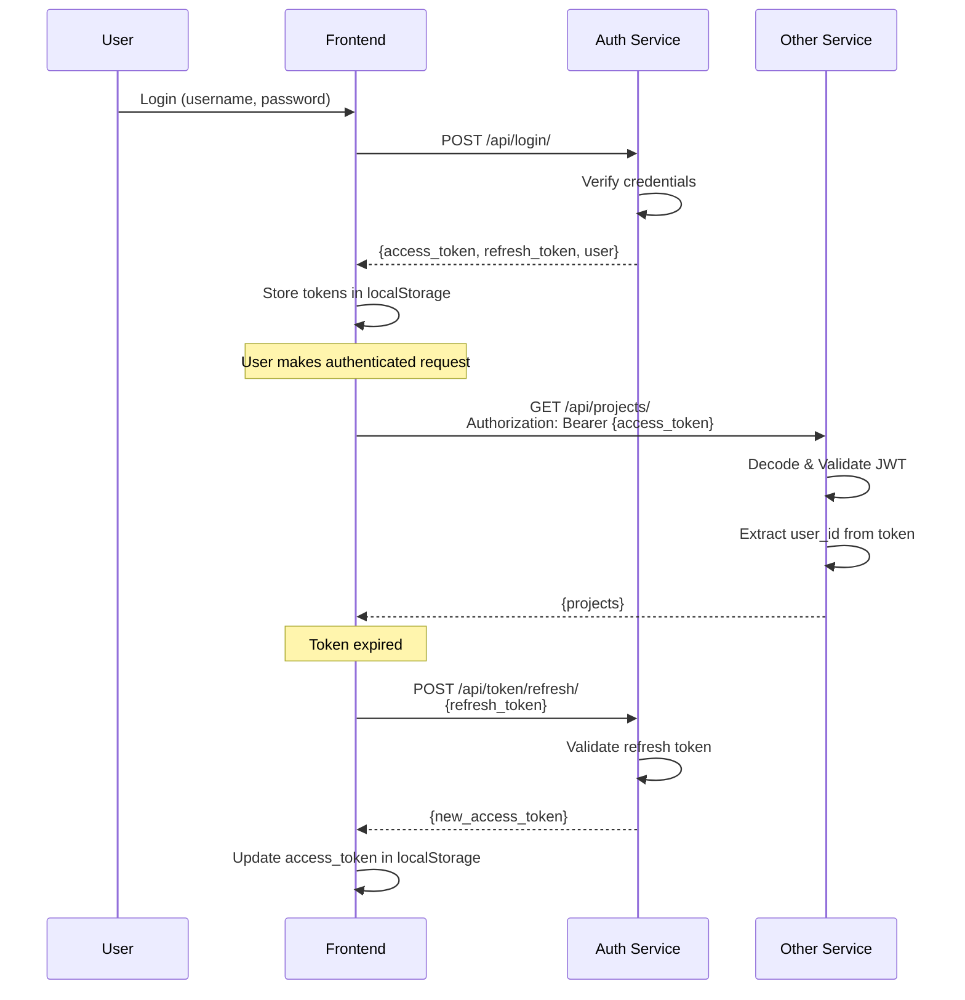

### Custom JWT Authentication

Каждый сервис (кроме Auth) использует **CustomJWTAuthentication**:

```python
class CustomJWTAuthentication(JWTAuthentication):
    def get_user(self, validated_token):
        user_id = validated_token.get('user_id')
        
        # Создаём простой объект пользователя
        class SimpleUser:
            def __init__(self, user_id):
                self.id = user_id
                self.is_authenticated = True
        
        return SimpleUser(user_id)
```

**Почему не User model?**
- Нет доступа к таблице users (другая БД)
- Не нужна вся информация о пользователе
- Только `user_id` для авторизации

### Token Lifecycle

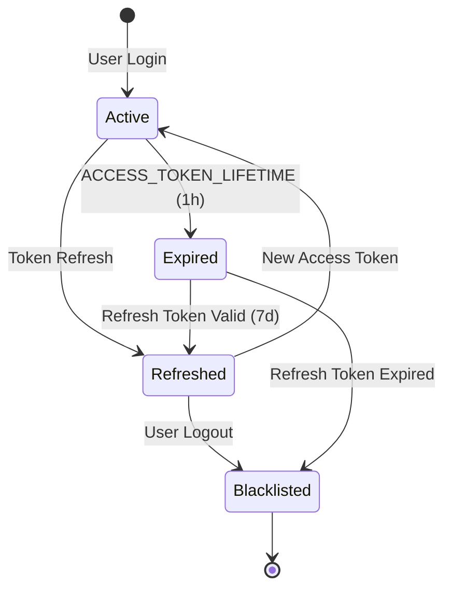

---

## 🚀 Deployment

### Docker Compose Architecture

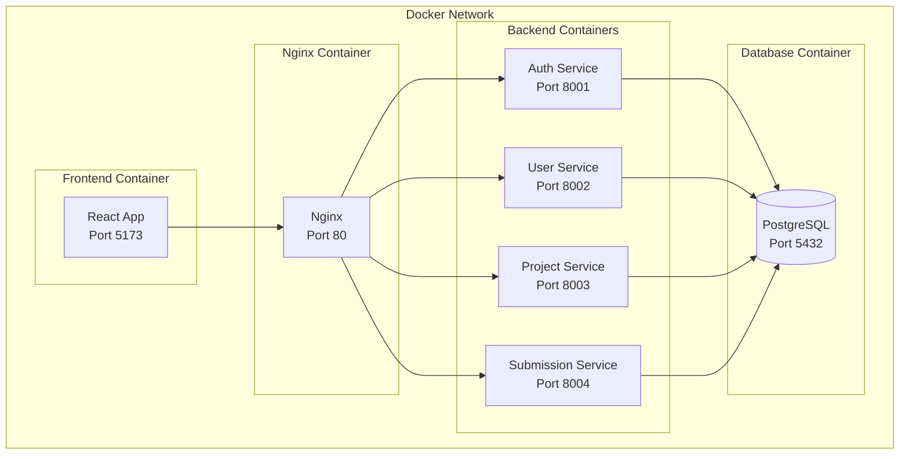

### Deployment Steps

```bash
# 1. Клонировать репозиторий
cd /Users/abylajhanbegimkulov/Desktop/sobes/gitproj

# 2. Запустить все сервисы
docker-compose up --build -d

# 3. Проверить статус
docker-compose ps

# 4. Создать суперпользователя
docker-compose exec auth_service python manage.py createsuperuser

# 5. Открыть приложение
open http://localhost
```

### Environment Variables

```bash
# Auth Service
SECRET_KEY=django-insecure-dev-key
DEBUG=True
DB_NAME=auth_db
DB_USER=postgres
DB_PASSWORD=postgres
DB_HOST=postgres
DB_PORT=5432

# User/Project/Submission Services  
# (аналогично с разными DB_NAME)
```

---

## 📈 Масштабирование

### Horizontal Scaling Strategy

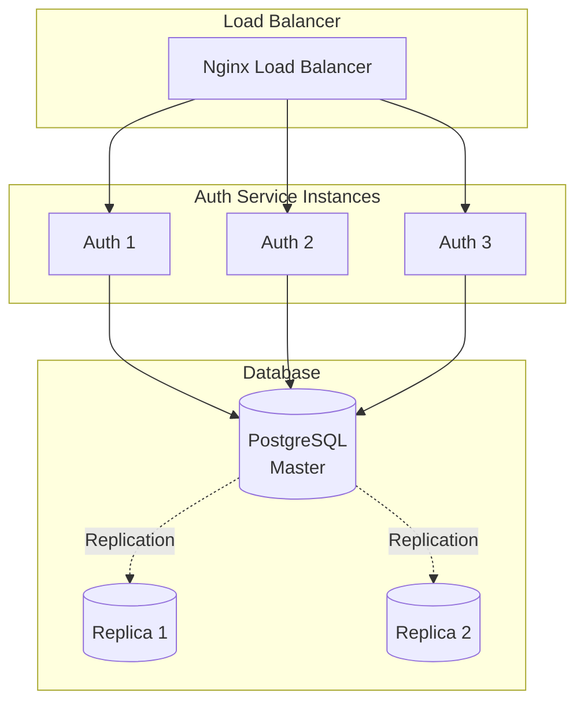

### Scaling Plan

**Phase 1: Vertical Scaling**
- Увеличение CPU/RAM контейнеров
- Оптимизация запросов к БД
- Добавление индексов

**Phase 2: Horizontal Scaling**
- Multiple instances каждого сервиса
- Nginx Load Balancer
- Session storage в Redis

**Phase 3: Database Scaling**
- Read replicas для PostgreSQL
- Connection pooling (PgBouncer)
- Sharding по user_id

**Phase 4: Caching Layer**
- Redis для кэширования
- CDN для статики
- API response caching

### Performance Optimizations

**Database:**
- ✅ Индексы на foreign keys
- ✅ Composite indexes для частых запросов
- ✅ Database connection pooling
- ⏳ Query optimization (N+1 problem)
- ⏳ Materialized views для аналитики

**Backend:**
- ✅ JWT вместо session-based auth
- ✅ Pagination для списков
- ⏳ Background tasks (Celery)
- ⏳ API response caching
- ⏳ Async views (Django Async)

**Frontend:**
- ✅ React code splitting
- ✅ Lazy loading компонентов
- ⏳ Service Workers (PWA)
- ⏳ Image optimization
- ⏳ GraphQL вместо REST (опционально)

---

## 🔒 Безопасность

### Security Measures

**Authentication:**
- ✅ JWT с коротким lifetime (1h)
- ✅ Refresh token rotation
- ✅ Token blacklisting
- ⏳ Rate limiting на login endpoint
- ⏳ 2FA (Two-Factor Authentication)

**Authorization:**
- ✅ Role-based access (student/teacher/admin)
- ✅ Permission checks на уровне ViewSet
- ⏳ Object-level permissions
- ⏳ Audit logging

**Data Protection:**
- ✅ Password hashing (Django default)
- ✅ HTTPS (в production)
- ⏳ Data encryption at rest
- ⏳ Secrets management (HashiCorp Vault)

**API Security:**
- ✅ CORS headers
- ✅ CSRF protection
- ⏳ Rate limiting (nginx)
- ⏳ API versioning
- ⏳ Input validation & sanitization

---

## 📊 Monitoring & Logging

### Monitoring Stack (Future)

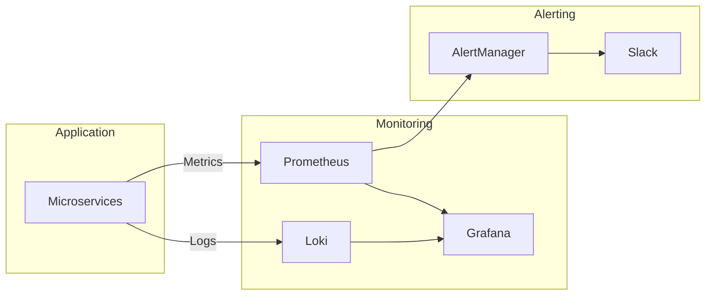

### Key Metrics

**Application:**
- Request rate (req/s)
- Response time (p50, p95, p99)
- Error rate (4xx, 5xx)
- Active users

**Infrastructure:**
- CPU usage
- Memory usage
- Disk I/O
- Network I/O

**Database:**
- Connection pool size
- Query duration
- Slow queries
- Deadlocks

---

## 🧪 Testing Strategy

### Test Pyramid

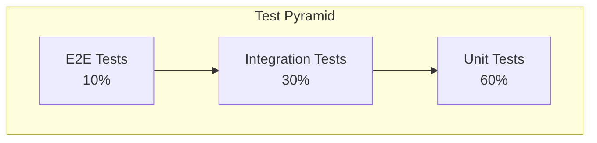

**Unit Tests:**
- Модели
- Сериализаторы
- Утилиты
- Бизнес-логика

**Integration Tests:**
- API endpoints
- Database operations
- Service-to-service calls

**E2E Tests:**
- User flows (login → create project → submit)
- Critical paths

---

## 📝 API Documentation

### Swagger/OpenAPI

Каждый сервис имеет **Swagger UI**:

- Auth: http://localhost:8001/swagger/
- User: http://localhost:8002/swagger/
- Project: http://localhost:8003/swagger/
- Submission: http://localhost:8004/swagger/

### API Versioning (Future)

```
/api/v1/projects/
/api/v2/projects/
```

---

## 🔄 CI/CD Pipeline (Future)

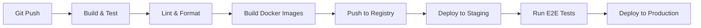

---

## 📚 Additional Resources

### Documentation
- [Django REST Framework](https://www.django-rest-framework.org/)
- [JWT Authentication](https://django-rest-framework-simplejwt.readthedocs.io/)
- [Docker Compose](https://docs.docker.com/compose/)
- [React Documentation](https://react.dev/)

### Best Practices
- [Microservices Patterns](https://microservices.io/)
- [12 Factor App](https://12factor.net/)
- [REST API Design](https://restfulapi.net/)

---

## 🎯 Roadmap

### v1.0 (Current)
- ✅ Базовая архитектура
- ✅ JWT аутентификация
- ✅ CRUD для всех сущностей
- ✅ Docker containerization
- ✅ Swagger documentation

### v1.1 (Next)
- ⏳ Unit tests (>80% coverage)
- ⏳ Integration tests
- ⏳ CI/CD pipeline
- ⏳ Monitoring & Logging
- ⏳ Performance optimization

### v2.0 (Future)
- ⏳ Real-time notifications (WebSocket)
- ⏳ File upload to S3
- ⏳ Email notifications
- ⏳ Advanced analytics
- ⏳ Mobile app (React Native)

---

## 👥 Team & Contributors

**Architecture:** System Design Team  
**Backend:** Django Team  
**Frontend:** React Team  
**DevOps:** Infrastructure Team  

---

## 📄 License

MIT License - see LICENSE file for details

---

**Last Updated:** November 29, 2025  
**Version:** 1.0.0
